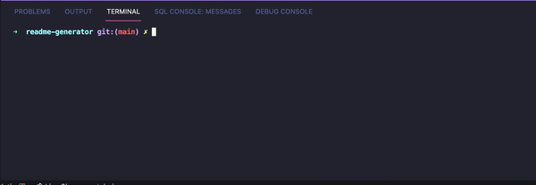
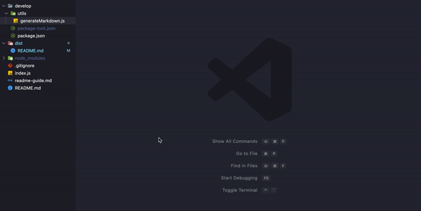

# Professional README Generator
  
  

## Summary

Generates a professional README through command-line prompts. Built with Node.js and [Inquirer.js](https://github.com/SBoudrias/Inquirer.js).

Includes dynamically generated titled sections, markdown formatting, table of contents with links and license badges from [shields.io](https://shields.io/category/license).

## Demo
### Initializing program:

### Navigating to generated README file:

## Installation
Clone the respository to your machine. Initialize NPM (`npm init -y`) and install inquirer (`npm i inquirer`) before running.

## Usage
Type `node.index` into the command line to initialize program. Fill out the on-screen prompts. Once finished, navigate to the `dist` folder for your new README.md file.

## Questions
  If you have any questions about this project, please open an issue or use the contact information below:
  * [katiechurchwell](https://www.github.com/katiechurchwell)
  * [churchwellcatherine@gmail.com](mailto:churchwellcatherine@gmail.com)